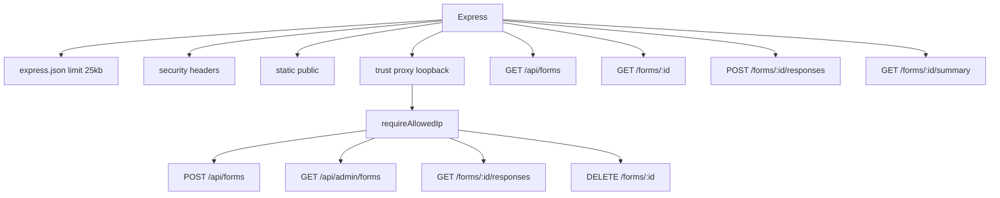

# 02 — Architecture

## Server `server.js:1` (748 lines)


### Critical Sections
- **Init `server.js:7-24`** — `createClient` with `ws` transport (unused, see P0 Tech Debt). `supabaseAdmin` fallback `|| supabase`.
- **Helpers `server.js:26-66`** — `asyncHandler`, `isLoopbackIp`, `clientIp`, `requireAllowedIp`.
- **Profanity `server.js:90-171`** — `BAD_WORDS[28]`, `BAD_WORD_PATTERNS` with `i` flag, `normalizeForProfanity` (zero-width strip, leet map, collapse `(.)\1{2,}`, `[^a-z]`→space), `tokenMatchesWithWildcard`, `findBadWord`, `scanAnswersForProfanity` (now `Set` deduped).
- **Rate `server.js:173-214`** — `ipStrikes Map`, `rateLimitMap`, `loopback:${ip}` per-IP, `setInterval` prune 60s.
- **Validation `server.js:223-371`** — `validateFormPayload` (checks `title 200`, `desc 500`, `questions 1-50`, `label 300`, `options 2-20 ×100`), `normalizeQuestions`, `isOtherValue` (inner 500 + total 2000), `validateAnswers` (extra keys, `__proto__`, dup, `Other`).
- **Routes** — all wrapped `asyncHandler(async (req,res)=>...)`.
- **Telegram `server.js:530`** — `notifyTelegram` with `telegramInFlight<5` + `AbortSignal.timeout(8000)` fallback.
- **Summary `server.js:570`** — `buildSummary` with `hasOwn` + `isOtherValue` strict, `limit 5000/1000`.
- **Error `server.js:734`** — `entity.parse.failed →400`, `entity.too.large→413`.

### Security Headers `server.js:22`
```
X-Content-Type-Options: nosniff
X-Frame-Options: DENY
Content-Security-Policy: default-src 'self'; img-src 'self' data: https:; style-src 'self' 'unsafe-inline' https://cdn.jsdelivr.net; ...
Referrer-Policy: strict-origin-when-cross-origin
Permissions-Policy: camera=(), microphone=(), geolocation=()
```

## Frontend `public/app.js:1` (1186 lines)
- **State `app.js:193`** — `currentFormId`, `currentQuestions`, `currentStep`, `hasSubmitted`, `isSubmitting`, `draftSaveTimer`, `view='welcome'|'question'`.
- **Theme `app.js:10`** — `initTheme()` reads `localStorage theme` or `prefers-color-scheme`, toggles `data-theme`, `updateThemeIcon`.
- **Profanity `app.js:90`** — `BAD_WORDS` same 27, `BAD_WORD_RE` with `\b\w{0,5}`, `normalizeClient` mirrors server, `tokenMatchesWithWildcard`, `clientHasBadWord`, `countClientProfanity` `Set`.
- **Draft `app.js:278`** — `draftKey() = draft_${id}`, `draftDismissKey() = dismiss_${id}`, `saveDraft()` 600ms debounce, `restoreDraftIfAny`, `checkDraftBanner`, `bindDraftBanner` with `confirmModal`.
- **Progress `app.js:836`** — `required = filter required!==false`, `totalReq = required.length||length`, `pct = answered/totalReq*100`, updates `progressBar`, `progressText`, `progressPct`.
- **Navigation `app.js:488`** — `advanceOrSubmit` guards `isSubmitting`, `showStep` handles `active/exiting`, `syncGridDone`, `handleGlobalShortcuts` (1-9, arrows).
- **Submit `app.js:950`** — `handleSubmit` `isSubmitting` guard, `firstMissing`, `isBlockedNow`, `checkProfanityField`, `fetch` without `strikeHint` (removed), `hasSubmitted` + `localStorage` cleanup, whiteScreen → video → success.
- **UX** — `shakeQuestion`, `showBlockedOverlay` `12000ms` video, `startCountdown`, `closeBlockedOverlay` clears both `strikes_global`, `playCelebrationVideo`, `beforeunload`, `visibilitychange` Notification + title flash, `15min` chime.

## DB `schema.sql:1` (45 lines)
```sql
forms (
  id SERIAL PK,
  title TEXT CHECK (char_length 1-200),
  description TEXT DEFAULT '' CHECK (<=500),
  questions JSONB CHECK (array 1-50),
  created_at TIMESTAMPTZ
)
form_responses (
  id SERIAL PK,
  form_id INT FK CASCADE,
  answers JSONB CHECK (object, <20k),
  submitted_at
)
idx_form_responses_form(form_id)
RLS: ENABLE, policy "public read forms" SELECT anon, policy "public submit responses" INSERT anon WITH CHECK(true)
```
- Note: CHECK constraints live in `validateFormPayload` `server.js:223` (app-level enforcement). `schema.sql` defines structure only.

## Public Assets
- `index.html:9` `:root` vars + inline ~880 lines (shadows `style.css:1` — P0 debt)
- `admin.html:7` duplicate Iconoir link (fixed in `admin.js:116` escaped)
- `results.html:51` `chart-toggle` bars/donut, `pagination` inline style
- `style.css:1` 955 lines, dark `html[data-theme="dark"]`, toast, modal, skeleton, `page.wide` bug (capped at 720)

## API Surface
| Method | Path | Gate | Limit |
|--------|------|------|-------|
| POST | /api/forms | IP | 25kb, 50 Qs |
| GET | /api/forms | public | 100 |
| GET | /api/forms/:id | public | - |
| POST | /api/forms/:id/responses | rate 30/60s | 25kb |
| GET | /api/forms/:id/summary | public/service | 5000 |
| GET | /api/forms/:id/responses | IP | 1000 |
| GET | /api/admin/forms | IP | 100 |
| DELETE | /api/forms/:id | IP | - |
| DELETE | /api/forms/:id/responses | IP | - |

See [[05-API]] for curl examples.
